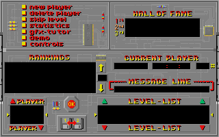
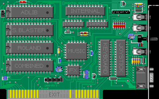
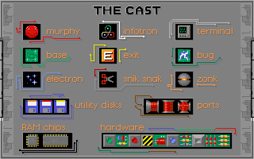
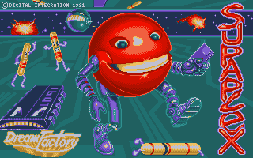
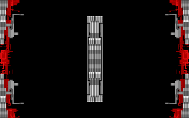
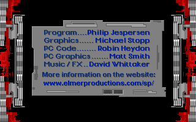
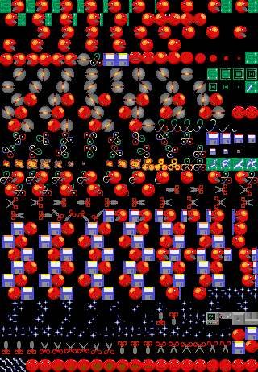

# Supaplex DAT → PNG extractor

A tiny utility to convert the Supaplex `.DAT` graphics files into viewable PNGs using the same bitplane decoding the original game uses.

## Requirements
- Python 3.9+
- Pillow (`pip install pillow`)

## Usage
Basic examples:
- `python sp_extract_dat_png.py --dat-dir ../resources --output-dir ./out`
- `python sp_extract_dat_png.py --files MENU.DAT TITLE.DAT --palette-file ../resources/PALETTES.DAT`

Notes:
- If `PALETTES.DAT` is available (auto-detected under `--dat-dir` or passed with `--palette-file`), the game palettes are used. Otherwise a grayscale fallback is applied, except for the built-in TITLE/TITLE1/TITLE2 palettes.
- Known files are listed in `DAT_SPECS` inside the script (MENU, BACK, CONTROLS, GFX, TITLE*, PANEL, MOVING, FIXED, CHARS6/8). Unknown `.DAT` files are skipped.

## Output previews
### menu

### back

### controls

### gfx

### title

### title1

### title2

### title_16

### panel

### moving

### fixed

### chars6

### chars8

## License
MIT. See [LICENSE](LICENSE).
